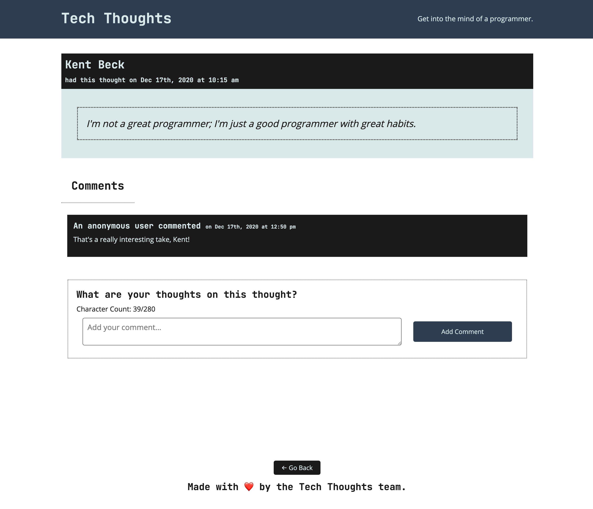

# 🏗️ Implement Single-Thought Page Display

Work with a partner to implement the following user stories:

* As a user, I want to view a list of thoughts from all users of the application.

* As a user, I want to view individual thoughts and a list of comments.

* As a user, I want to be able to submit my own thoughts.

* As a user, I want to be able to submit my own comments on an individual thought.

## Acceptance Criteria

The activity is complete when the following criteria are met:

* When I load the homepage, I am shown a list of thoughts from every user of the application.

* When I attempt to submit a new thought, my information is accepted by the form and a new thought is displayed on the page.

* When I visit the individual thought page, I'm shown a single thought and its comments.

* When I attempt to submit a new comment on a thought page, my information is accepted by the form and displayed on the page.

## Assets

The following image demonstrates the web application's appearance and functionality:

---

## 💡 Hints

* How can the client development server communicate its request for data to the server?

* What kind of value is returned from the `useMutation` hook?

## 🏆 Bonus

If you have completed this activity, work through the following challenge with your partner to further your knowledge:

* What is the purpose of the useLazyQuery hook? Can you think of an example where it could be useful?

Use [Google](https://www.google.com) or another search engine to research this.

---

© 2024 edX Boot Camps LLC. Confidential and Proprietary. All Rights Reserved.
